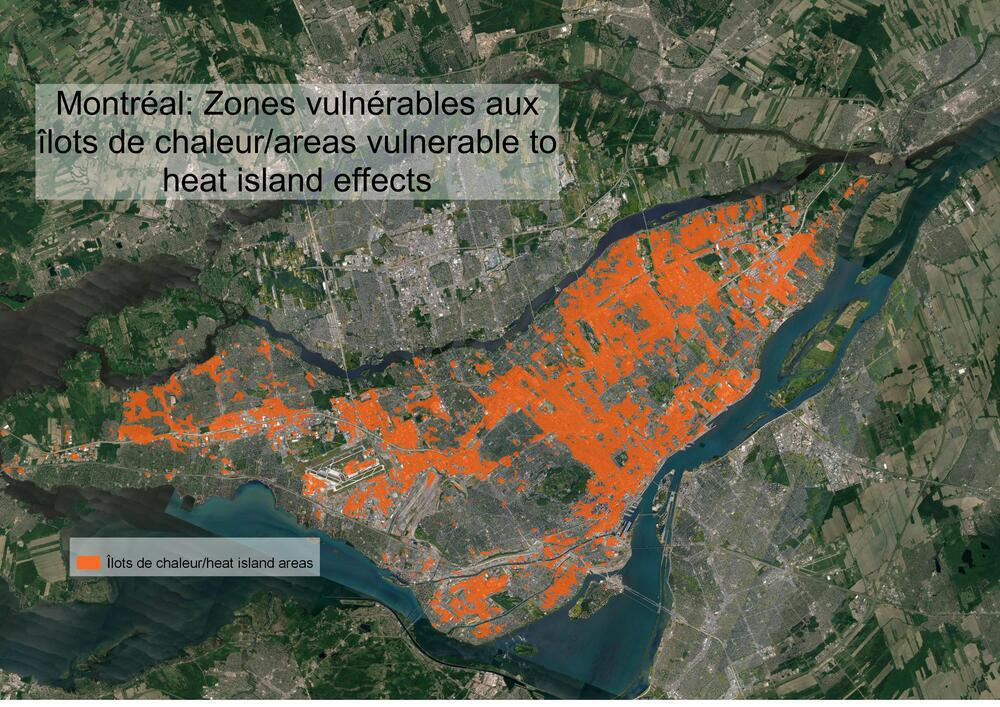

```{r setup, include=FALSE}
knitr::opts_chunk$set(echo = TRUE)
library(here)
```

## PMD (Administration Coderre): 

Tandis que le contenu du PMD s'addresse surtout à l'atténuation des changements climatiques par la réduction des émissions de la communauté par des changements aux habitudes des citoyens, des entreprises, et de la ville, le Plan d'adaptation aux changements climatiques de l'agglomération de Montréal (PACCAM) de l'administration Coderre vise exclusivement l'adaptation. Le PACCAM décrit les actions que devront être entreprises à court et moyen-terme par l'administration municipale et des arrondissements pour assurer l'adaptation aux crises résultant des changements climatiques, tels que des tempêtes fréquentes, des sécheresses, des températures extrêmes, des pluies abondantes, et des inondations. Les actions de l'administration municipale sont présentés comme étant des engagements, tandis que les arrondissements peuvent adopterou non ces politiques sur une base purement volontaire. Il n'y a aucun méchanisme en place pour s'assurer de la mise en place de ce plan dans les arrondissements. Le PACCAM a été mis à jour en 2017 et les progrès du plan ont été évalués en 2019.

Les objectifs du PACCAM se superposent parfois à ceux du PMD. Les deux document prévoient une expension de la canopée urbaine à 25% de la superficie de l'agglomération, et une augmentation des lieux protégés à 10% de la superficie. Le PACCAM inclut également des objectifs non-spécifiés, tels que la préservation des berges et des milieux humides, la protection de la biodiversité, et la réduction des îlots de chaleur. Les politiques de la ville et les mesures volontaires que peuvent adopter les arrondissements et les villes de l'agglomération sont généralement d'envergure limitée. Par exemple, la ville promet d'essayer des alternatives aux surfaces minéralisées, et promet de maximiser l'infrastructure verte. Les arrondissements sont invités à augmenter leur offre d'activités hivernales et estivales, à tondre plus régulièrement le gazon dans les lieux publics, et à inspecter régulièrement leurs bâtiments et les systèmes d'égoûts. Il va sans le dire que ce document de 246 pages est gonflé par plusieurs mesures qui forment la base d'une bonne gouvernance, et qui délaissent une grande partie des responsabilités de la ville en matière d'adaptation aux arrondissements qui adopteront ou non ces mesures à des rythmes variables et en proie à leurs contraintes budgétaires.

## Plan climat (Administration Plante): 

Accorder de 10 à 15% du budget décennal d'immobilisations aux mesures d'adaptation. Encourager l'émergence de pôles de résilience communautaires. Adapter les règlements de la ville en matière de construction et de rénovation afin de prioriser la transition écologique en adoptant des critères d'efficacité énergétique  des des critères architecturaux favorisant la résilience. Accroître la résilience at l'efficacité énergétique des bâtiments du programme AccèsLogis.

## Discussion

Le PACCAM et le Plan climat présentent des approches trèes différentes envers la gestion de l'adaptation et de la résilience. Le PACCAM prend une approche basé sur l'adoption de mesures d'adaptation sur une base volontaire, préférant une prise de responsabilité par les arrondissements, avec un minimum d'encadrement par l'administration municipale. Le Plan climat prévoit une approche directe par des subventions, des règlements et de l'investissement. Il semblerait que nous vivons un important changement dans l'élaboration des plans climats. Dans les premiers plans de la ville de Montréal dans les années 2000, l'idée de l'adaptation était entièrement absente. Dans le PACCAM et le PMD, rédigés en 2015 et 2016, l'adaptation est présente, mais ne constitue pas une des grandes priorités. En 2020, l'adaptation est une des premières priorités, à laquelle la ville est prête à dévouer entre 10 et 15% de son budget sur 10 ans, ayant le potentiel d'un énorme impact matériel. Possiblement en raison de l'implication de Montréal dans le réseau des 100 Resilient Cities (100 RC), et son plan de résilience de 2018, le Plan climat 2020-2030 inclut plus de stratégies d'adaptation que tout autre plan climat de la ville, excluant le PACCAM. Cela est peu surprenant, car le département de la ville qui a émergé de sa participation au 100 RC, l'office minicipal de la résilience a été rebaptisé l'office municipal de de la transition écologique et de la résilience, et a joué un rôle important dans l'élaboration du Plan climat. Le directeur municipal de la transition écologique et de la résilience, Sidney Ribaux a été un contributeur important. L'adaptation et le résilience reçoivent maintenant un financement direct et sont directement appliqués sur le cadre bâti et le développement communautaire, au lieu d'être des mesures volontaires entreprises en majorité par les arrondissements.

```{r, echo=FALSE, fig.align = 'center', warning=FALSE, out.width="75%", fig.cap="Les îlots de chaleur représentent l'un des plus importants défis d'adaptation auxquels Montréal devra faire face."}



```