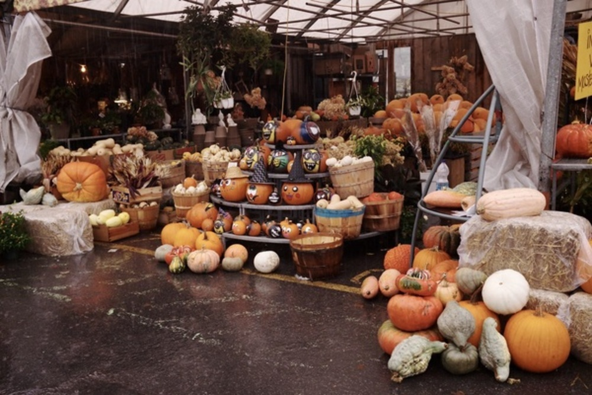

```{r setup, include=FALSE}
knitr::opts_chunk$set(echo = TRUE)
library(here)
```

```{r, echo=FALSE, fig.align = 'left', warning=FALSE, out.width="50%", out.extra='style="float:right; padding:10px"'}



```

## PMD (Coderre administration): 

Direct nearly $1 million in community organization funding towards programs promoting healthy lifestyles (healthy eating and physical activity). Create a municipal food policy for cultural, athletic and administrative installations.

## Plan climat (Plante administration): 

Create a bio/agribusiness innovation cluster based in the circular economy to secure Montreal’s food transition. Support community gardens as part of resilience zones. Collaborate with actors within the sector, elaborate a complete vision for urban agriculture in Montreal. Create a strategy to reduce food waste by 50% by 2025, with a public consultation planned for 2021.

## Discussion

```{r, echo=FALSE, fig.align = 'left', warning=FALSE, out.width="50%", out.extra='style="float:right; padding:10px"'}

knitr::include_graphics("visuals/food/market_1.jpeg")

```

The PMD’s approach to food and health planning is focused on promoting healthy lifestyles through food policy and the funding of local initiatives. One of the plan’s stated goals is to ‘integrate urban agriculture and healthy lifestyles into neighbourhoods’ DNA’, though it is short on specific proposals to achieve this and does not discuss criteria for distributing the promised funds. The Plan climat goes into greater depth, connecting food and urban agriculture policy to its other initiatives, linking it to community organization, the growth of social capital, greening and innovation. Ultimately, however, both plans are short on specifics, and it remains to be seen what the Plan climat’s urban agriculture and food waste strategies will be once they are released.