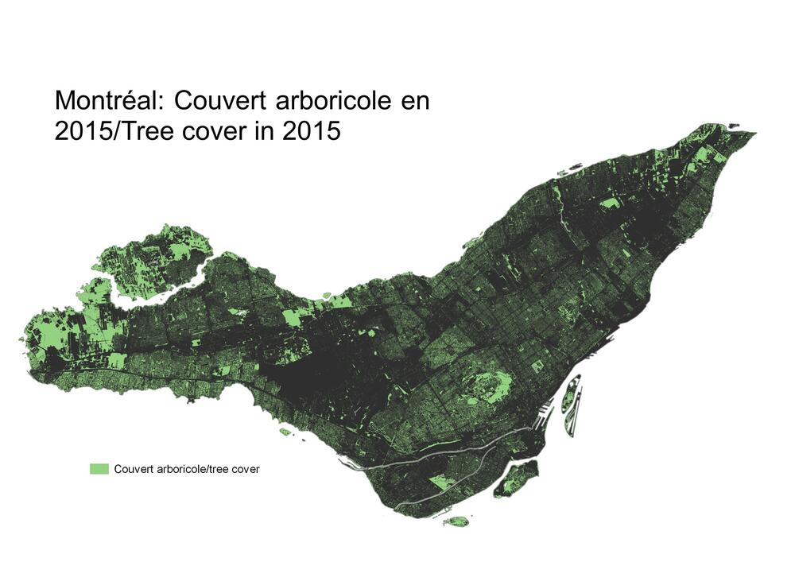

```{r setup, include=FALSE}
knitr::opts_chunk$set(echo = TRUE)
library(here)
```

## PMD (Coderre administration): 

Plant 300,000 trees by 2050. Add 1000 hectares of protected space. Double the number of green roofs on municipal buildings. “Greening” municipal regulations. Begin a phytoremediation research project covering four hectares in order to reduce soil toxicity, negotiating with other levels of government for funding. Encourage partner organizations to contribute to greening projects. Encourage partner organizations to combat invasive species and prevent their introduction. Add four hectares of parks and other public spaces to the Université de Montréal campus project.

## Plan climat (Plante administration): 

Plant, preserve and protect 500,000 trees, prioritizing zones vulnerable to heatwaves, 50% funded from the 10-year capital budget (can we find out where the other half comes from, if not the capital budget?). Increase protected land area from 6.1% to 10%. Restore selected riverbanks. Tighten regulations on pesticides while considering alternate control methods. Support greening and community gardening as parts of resilience zones which will grow local social capital. 

## Discussion

```{r, echo=FALSE, fig.align = 'left', warning=FALSE, out.width="50%", out.extra='style="float:right; padding:10px"'}



```

Both plans’ greening agendas are straightforward and near-identical. They aim to make the city greener in the simplest possible ways: more trees, more protected space for parks and forests, and involving the community in local projects to add greenery to their neighbourhoods. While there has been a lack of progress on the expansion of protected land area (over the five years between plans the goal has remained to increase this area to 10% of the island), some projects are in the pipeline, such as the Grand parc de l’Ouest. Further monitoring of changes in green space and canopy may help to determine how tree planting and the growth of green spaces has been distributed, as neither plan specifies exactly where planting of trees and expansion of green space will occur, though the Plan climat does hint at targeting areas vulnerable to heat for tree planting, which may help mitigate extreme highs in temperature.