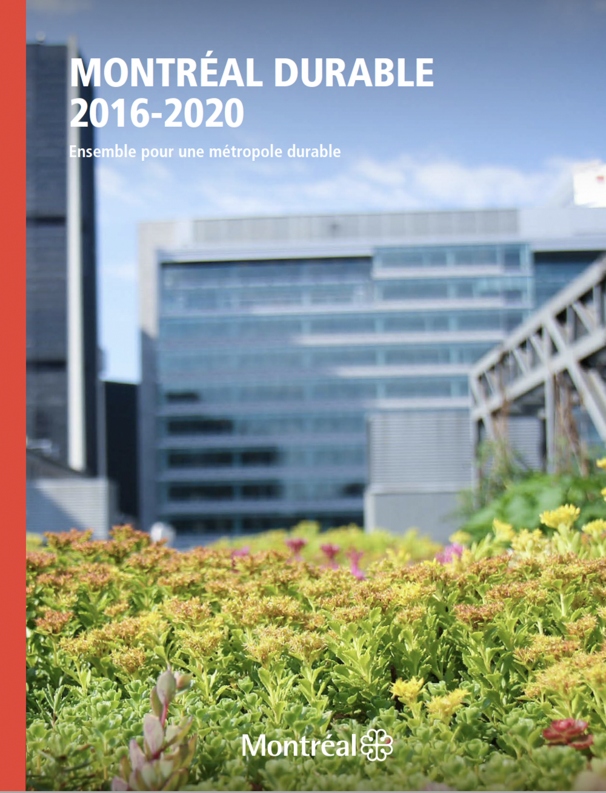
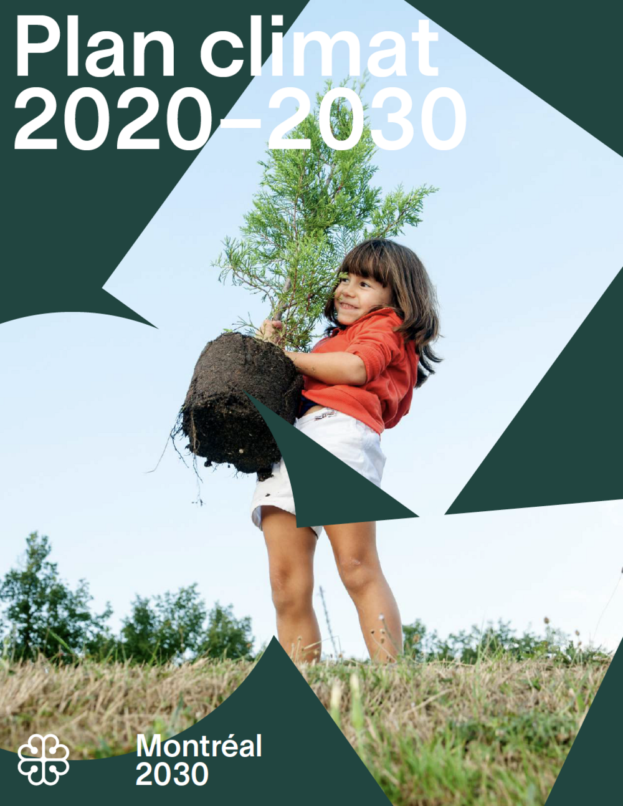

```{r setup, include=FALSE}
knitr::opts_chunk$set(echo = TRUE)
library(here)
```

As the need to address climate change has grown more pressing, cities have released plans that attempt to organize efforts at mitigating emissions of greenhouse gases, adapting to the effects of warming, and making their institutions, businesses and populations more resilient. This module explores Montreal's last two climate plans: the Plan Montréal durable 2016 (PMD) of Denis Coderre's administration, and the Plan climat 2020-2030 (Plan climat) of Valérie Plante's administration. 

```{r, echo=FALSE, fig.align = 'center', warning=FALSE, out.width="48%", out.extra='style="padding:10px"'}



```
```{r, echo=FALSE, fig.align = 'center', warning=FALSE, out.width="48%", out.extra='style="padding:10px"'}



```
This module allows you to explore the climate policies included in these two plans classified according to categories that can be accessed below:

• Community and participation: overview of the climate plans' policies to mobilize Montreal's citizens, organizations and various stakeholders.

• Greening: policies which act on green space, trees and tree cover, and community gardens.

• Food and agriculture: policies aimed at the supply and quality of food, as well as community gardening.

• Land use: policies aimed at promoting urban forms likely to mitigate and adapt to climate change.

• Mobility: policies for public transportation, active transportation, electric mobility, and the city's transportation assets.

• Equity: policies aimed at promoting equity and solidarity through accessibility, availability of housing, services, and aid to marginalized groups.

• Adaptation and resilience: policies aimed at curbing the negative impacts of an already-changing climate. *The Coderre administration section mainly concerns the Plan d'adaptation aux changements climatiques instead of the Plan Montreal durable.

• Economy: policies concerning the transition towards a more sustainable economy, particularly locally.

• Innovation: policies promoting and deploying innovative sectors of Montreal's economy, particularly renewable energy and electric mobility.

• Regionalism, internationalism and networks: description of Montreal's commitments and connections to regional and international networks and agreements over the course of its last two climate plans.

• Sustainability: policies for sustainable development through the regulation of construction and buildings, the provision of services, and governance.