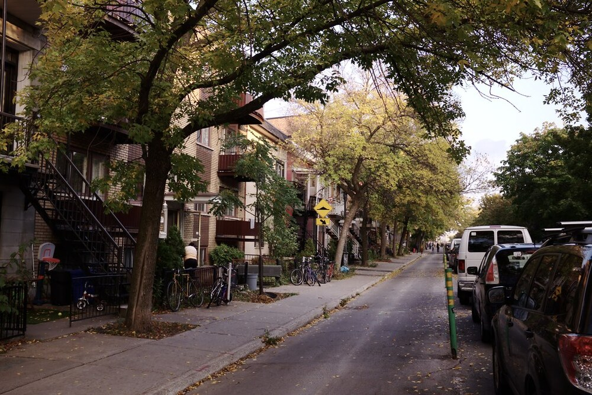
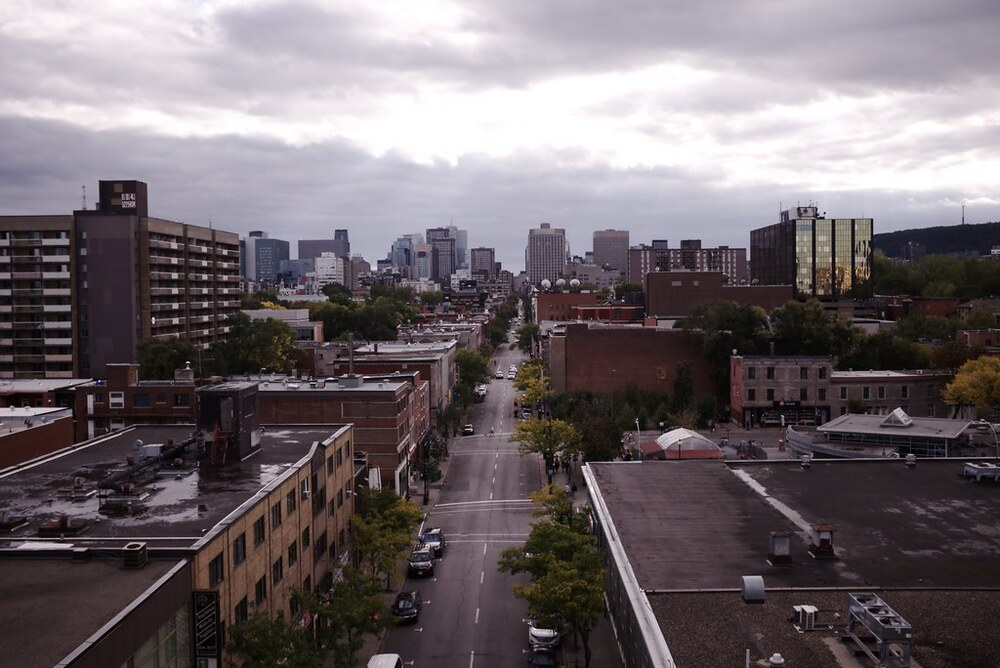

```{r setup, include=FALSE}
knitr::opts_chunk$set(echo = TRUE)
library(here)
```

## PMD (Administration Coderre): 

```{r, echo=FALSE, fig.align = 'left', out.width="50%", out.extra='style="float:right; padding:10px"'}



```

Le PMD ne comprend pas de politiques spécifiques à l'utilisation du sol. Il est axé sur l'introduction d'infrastructures vertes et d'une mobilité à faibles émissions dans les quartiers existants. Bien que les quartiers à "«échelle humaine» soient abordés et fassent partie des objectifs centraux du plan, aucun mécanisme n'est proposé pour modifier l'utilisation du sol afin de créer ou de préserver de telles zones.

## Plan climat (Administration Plante): 

Améliorer les outils de planification de la ville pour favoriser la construction de quartiers à l'échelle humaine adaptés au changement climatique en tenant compte des usages mixtes, de la résilience, de la verdure, du transport actif et l'accès aux services. Convertir les parkings à ciel ouvert en logements denses ou en espaces verts. Créer des écoquartiers carboneutres, en s'inspirant de l'aménagement en cours de l'Hippodrome.

## Discussion

```{r, echo=FALSE, fig.align = 'left', out.width="50%", out.extra='style="float:right; padding:10px"'}



```

Bien qu'aucun des deux plans n'aborde en profondeur la question de l'utilisation du sol, le PMD l'évite complètement. Le Plan climat, quant à lui, aborde des changements non spécifiques aux pratiques d'utilisation du sol de la ville en encourageant une trame urbaine plus dense, la réduction de l'utilisation de l'automobile, l'utilisation des transports publics et la prise en compte des risques climatiques. Le Plan climat est plus enclin à discuter de la réécriture des règlements d'urbanisme, à expérimenter de nouvelles formes urbaines et à s'appuyer sur celles qui ont fait leurs preuves. La liste de souhaits pour les quartiers montréalais de l'avenir (usages mixtes, résilients, verts, actifs et à proximité des services) pourrait finir par avoir une influence au-delà des simples notions d'utilisation du sol et de zonage, en ayant un impact sur les autres catégories de politiques de ce document (verdissement, économie, équité, etc.). C'est encourageant, mais en l'absence de suivi, il sera difficile de déterminer quels changements ont été effectués.
