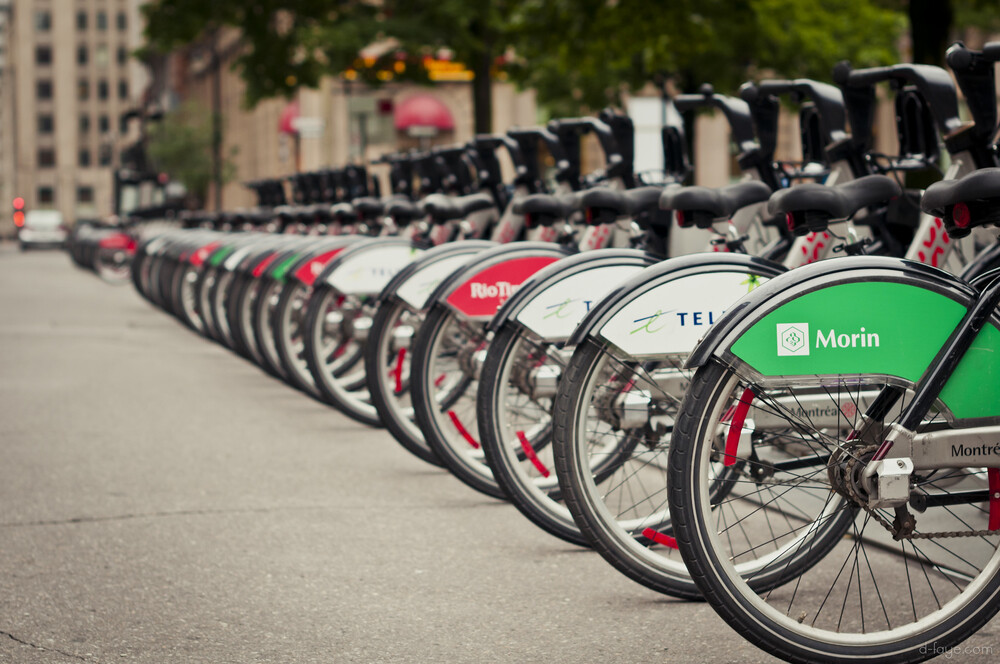
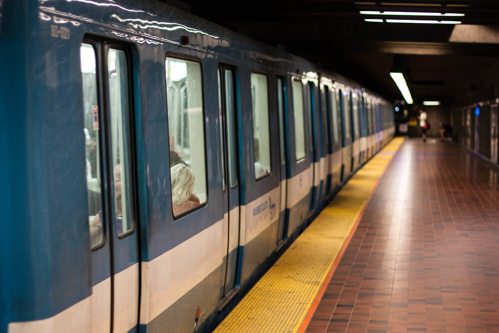

```{r setup, include=FALSE}
knitr::opts_chunk$set(echo = TRUE)
library(here)
```


## PMD (Coderre administration): 

```{r, echo=FALSE, fig.align = 'left', warning=FALSE, out.width="50%", out.extra='style="float:right; padding:10px"'}



```

#### Public transportation

Add $100M to the city’s contribution to public transportation. Convert 30% of the city’s bus fleet to hybrid vehicles. Encourage partner organizations to incentivize employees’ use of public transportation.

#### Active transportation

Add 20 pedestrian or shared streets. Add 270km to the city’s bike network.

#### Electric mobility

Add 1000 electric vehicle charging stations in Montreal. Create a legal framework allowing private companies to deploy 1000 electric vehicles for self-service.

#### Municipal transportation assets

Convert 230 of the city’s vehicles to electric propulsion. Replace 100 of the city’s vans with smaller cylinder models.
 

## Plan climat (Plante administration): 

```{r, echo=FALSE, fig.align = 'left', warning=FALSE, out.width="50%", out.extra='style="float:right; padding:10px"'}



```

#### Public transportation

Continue support for taxis, carpooling and self-service vehicles. Use major projects such as the REM, the blue line extension, the western branch of the orange line, and the pink line to improve service and reduce overall emissions. Complete the Pie-IX BRT. Add 300 hybrid buses to the STM fleet.

#### Active transportation

Continue development of cycling infrastructure through projects such as the REV. Increase the availability of bike-shares, particularly for electric bicycles. Create incentives for cycling, reduction of solo car trips, and emission-free delivery services. Make city employees’ movement carbon-neutral and favour telework to save on total travel.

#### Electric mobility

Create a downtown zero-emissions zone, in part by increasing the number of public and private charging stations available in the area. Deploy significant investment into increasing the share of electric vehicles on Montreal’s streets. Increase the total number of charging stations on the island so that 30% of vehicle use is electric.

#### Municipal transportation assets

Support the STM in converting its bus fleet to 100% electric by 2040. Optimize the city’s fleet of vehicles, converting to electric propulsion when possible and increasing overall efficiency.


## Discussion

The PMD’s mobility goals are modest, and build off of the objectives of previous city plans. They aim to improve pedestrian and cycling mobility, and make early investments into electric vehicles. The PMD does not discuss or propose any major public transportation projects. The Plan climat is marked by the ambitious public transportation infrastructure projects promised by the Plante administration, many of which have been completed, or are in progress. The plan also promises “universal sustainable mobility” throughout Montreal and lower prices for children and the elderly. It also favours building up electric vehicle infrastructure, such as a downtown zero-emissions zone adapted to electric mobility. The Plan climat says little about pedestrian mobility, instead focusing on electric vehicles and mass public transit. Though it could be inferred that if changes to land use deliver denser neighbourhoods, pedestrian mobility will improve.

These mobility policies reflect significant politically-based difference between the climate plans. Transportation projects were a large part of Plante’s electoral platform, while Coderre has defined himself against these large projects and tends to align himself with more distant and automobile infrastructure-reliant boroughs. It is of interest, however, that Coderre's PMD promises a larger addition to cycling infrastructure than Plante's Plan climat, given that Coderre and his political base are lukewarm, at best, towards this kind of active mobility.

```{r, echo=FALSE, fig.align = 'center', warning=FALSE, out.width="75%", fig.cap="The automobile remains the dominant mode of transportation in the metropolitan region."}

knitr::include_graphics("visuals/mobility/mode_share.png")

```
