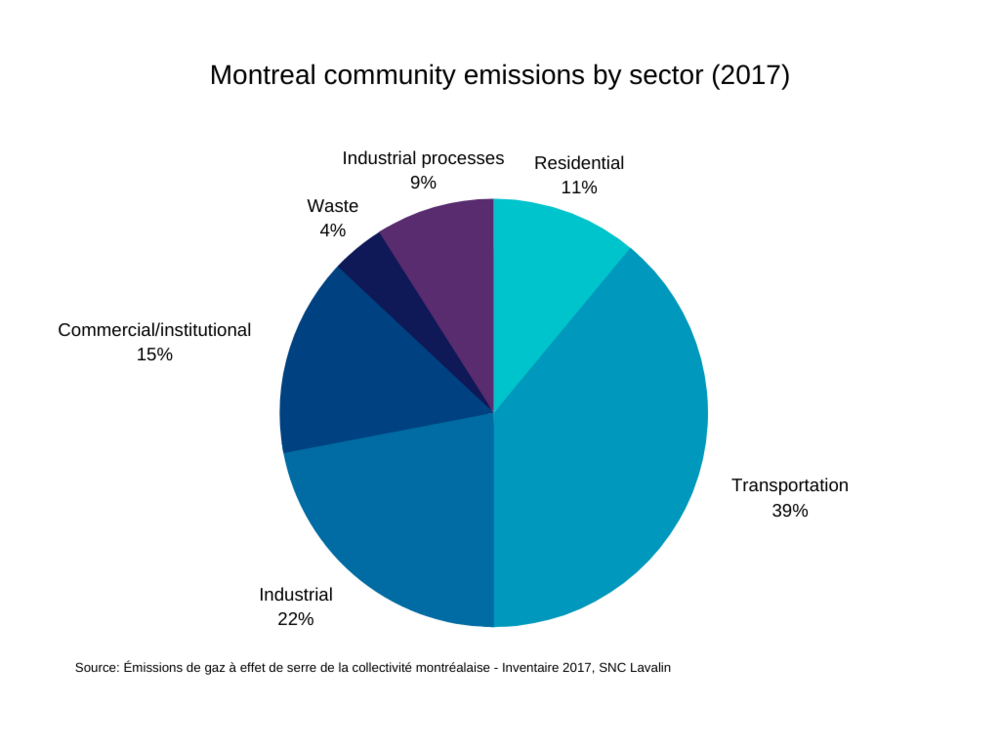

```{r setup, include=FALSE}
knitr::opts_chunk$set(echo = TRUE)
library(here)
```

## PMD (Administration Coderre): 

#### Bâtiment

Atteindre 70 bâtiments municipaux avec une certification LEED ou BOMA BEST. Réduire de 5 % la consommation énergétique des bâtiments municipaux. S'assurer que 75 % des subventions accordées aux entreprises pour la construction, l'agrandissement ou la rénovation de bâtiments respectent des critères environnementaux.

#### Gouvernance

Bonifier les politiques d'approvisionnement socialement responsable de Montréal. Dresser un portrait des investissements de Montréal dans les combustibles fossiles et étudier les possibilités de désinvestissement. 

#### Services

Réduction de 20 % de l'eau potable produite par les stations d'épuration de Montréal par rapport à 2011. Maintenir un taux de renouvellement des aqueducs supérieur à 1 %. Installer une station de désinfection à l'usine de filtration d'eau. Construire un tunnel pour protéger la conduite d'arrivée de l'usine de filtration d'Atwater des dommages causés par la circulation automobile. Corriger 275 raccordements croisés. Construire des bassins de rétention pour une capacité supplémentaire de 130 000 mètres cubes. Mettre en œuvre le plan de gestion de l'eau de la ville. Étendre les services de compostage à 100 % des bâtiments de 8 logements ou moins. Étendre la collecte des déchets, du recyclage et du compost aux zones à forte circulation et aux bâtiments publics municipaux. 

## Plan climat (Administration Plante): 

#### Bâtiment

Améliorer l'efficacité énergétique des bâtiments par la mise en place d'un système de classement et de rapports (pour les bâtiments privés) en commençant par les grands bâtiments commerciaux et institutionnels. Interdire l'utilisation de combustibles fossiles dans tous les bâtiments municipaux, qui seront alimentés exclusivement par des énergies renouvelables. Créer de nouvelles normes pour l'efficacité énergétique et les émissions des bâtiments municipaux. Contrôler les émissions provenant de la climatisation des bâtiments publics. Encourager l'abandon du chauffage au mazout pour les bâtiments commerciaux et résidentiels.

#### Gouvernance

Produire un inventaire complet des émissions de GES provenant des habitudes de consommation de la communauté montréalaise. Mettre en place des mesures permettant à la ville d'atteindre ses objectifs en matière de gestion des déchets, notamment l'élimination des plastiques à usage unique, le don et la réutilisation des textiles et la mobilisation de la communauté. Créer un «test climatique» qui servira à évaluer l'impact de toutes les décisions de la ville. Déployé sur trois ans, ce test s'appliquera d'abord aux grands projets tels que les infrastructures, puis à terme à toutes les décisions. Établissement d'un «budget carbone» pour la collectivité montréalaise, sur la base des repères établis par le C40. Ajout d'un chapitre sur le climat dans le budget annuel de la ville. Créer un plan de travail pour réduire les émissions des chantiers de construction. Créer une zone zéro émission au centre-ville d'ici 2030. Financement des propriétaires de bâtiments résidentiels privés pour qu'ils entreprennent des travaux d'amélioration de la durabilité/de l'efficacité.  

#### Services

Permettre le don et la réutilisation des textiles (les textiles représentent 4% des émissions des grandes villes du monde). Remplacer les incinérateurs de l'usine de filtration d'eau Jean-R.-Marcotte. Installer des filtres pour capter le méthane produit par le Complexe environnemental Saint-Michel.

## Discussion

```{r, echo=FALSE, fig.align = 'center', warning=FALSE, out.width="80%"}


```

Les plus grandes différences entre le PMD et le Plan climat en termes de politiques de développement durable sont l'accent mis par le PMD sur les services (l'eau en particulier), et l'accent mis par le Plan climat sur la réforme de la gouvernance de Montréal pour une meilleure durabilité. En effet, plusieurs des politiques les plus intéressantes proposées dans le Plan climat sont orientées vers la gouvernance et, selon leur mise en œuvre, pourraient apporter de profonds changements.  Les politiques de construction sont en quelque sorte progressives, notamment dans leur façon d'agir sur les actifs municipaux. D'abord l'amélioration de l'efficacité des bâtiments municipaux et l'obtention de certifications dans le PMD, puis l'interdiction de l'utilisation de combustibles fossiles dans ces bâtiments et la mise en place de nouvelles normes d'efficacité énergétique et de climatisation dans le Plan climat. La réglementation de la construction et les programmes de réglementation et de subvention de l'efficacité énergétique des bâtiments du Plan climat pourraient être très efficaces en termes de réduction des émissions si de nouveaux règlements sont effectivement proposés et approuvés et si le programme de financement peut être mis en place. Dans une ville où 28 % des émissions totales proviennent des bâtiments (résidentiels, commerciaux et institutionnels), une réglementation plus stricte en matière d'efficacité énergétique et de construction propre sera très utile. Comme c'est le cas pour de nombreuses politiques du PMD et du Plan climat, les détails sont difficiles à trouver, en particulier pour les mesures de gouvernance les plus radicales. Le PMD ne définit pas l'envergure de ses politiques d'approvisionnement responsable, ni sa promesse d'étudier le désinvestissement des combustibles fossiles. Le Plan climat explique peu les paramètres de son budget carbone et de son test climatique pour les décisions municipales.

```{r, echo=FALSE, fig.align = 'center', warning=FALSE, out.width="80%"}
knitr::include_graphics("visuals/sustainability/emissions_source.png")

```