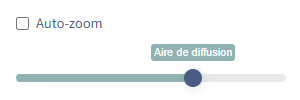
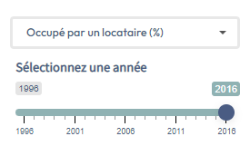
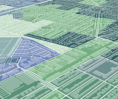
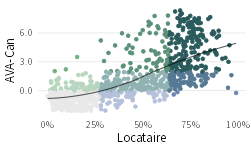
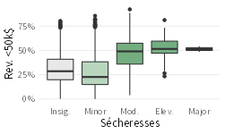
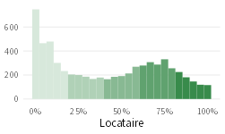

```{r setup, include=FALSE}
knitr::opts_chunk$set(echo = TRUE)
```

```{r, echo=FALSE, fig.align = 'right', warning=FALSE, out.width="auto", out.extra='style="float:right; padding:10px;"'}



```
Curbcut est conçu comme une série de modules qui explorent un thème particulier. Le menu supérieur vous permet de voir tous les modules de Curbcut. Vous pouvez cliquer sur celui qui vous intéresse pour en savoir plus. Toutes les cartes de Curbcut sont interactives et permettent aux utilisateurs de faire défiler, de zoomer et de cliquer sur des zones pour obtenir plus d'informations. Le niveau de zoom détermine l'échelle spatiale de ce que vous voyez. Vous pouvez également désactiver le zoom automatique et choisir l'échelle spatiale à l'aide du curseur. Vous pouvez donc examiner les données au niveau de l'arrondissement/de la ville d'abord, puis, en zoomant, voir des géographies de recensement plus petites comme les secteurs de recensement et les aires de diffusion. Certains modules vous permettent de zoomer davantage pour voir des bâtiments individuels et/ou des données par point.
```{r, echo=FALSE, fig.align = 'left', warning=FALSE, out.width="auto", out.extra='style="float:left; padding:10px; padding-bottom:20px"'}



```

La nature interactive de ces cartes signifie que vous pouvez choisir les variables (par le biais de menus déroulants) que vous souhaitez explorer et comparer, et (dans certains cas) vous pouvez également choisir l'année ou la période que vous souhaitez explorer.

### Comparer des variables avec des <span style="color:#3d85c6">cartes bivariées</span>
```{r, echo=FALSE, fig.align = 'right', warning=FALSE, out.width="auto", out.extra='style="float:right; padding:10px"'}



```
Les cartes bivariées vous permettent d'explorer la relation spatiale entre deux variables de votre choix. Ces cartes sont générées en divisant chaque variable en trois quantiles (tertiles), ce qui donne neuf valeurs possibles dans les cartes choroplèthes résultantes. Cela vous permet de voir facilement les endroits de la région qui obtiennent des résultats élevés pour les deux valeurs ou faibles pour l'une et élevés pour l'autre. Cela peut être utile pour comprendre où donner la priorité aux politiques ou aux interventions.

### Examinez les distributions de variables à l'aide <span style="color:#6aa84f">d'histogrammes, de diagramme en boîte et de diagrammes de dispersion</span>
```{r, echo=FALSE, fig.align = 'right', warning=FALSE, out.width="auto", out.extra='style="float:right; padding:10px; padding-bottom:0px; padding-top:0px;"'}



```
En cliquant sur une zone affiché sur la carte, vous pouvez en savoir plus sur cette région spécifique et sur sa relation avec la distribution globale des données. Les distributions sont affichées sous forme d'histogrammes, de diagrammes en boîte ou de diagrammes de dispersion, selon le type de données.

### En savoir plus sur les lieux avec <span style="color:#a64d79">des pop-ups</span>
Certain modules allow you to learn more about specific themes in Montreal. By clicking on the lines or points displayed on the map, you can learn more from each individual location, and even see pictures when they are available.

### Vous avez envie de lire ? Consultez les <span style="color:#e69138">articles du blog de Curbcut !</span>
Toutes les informations ne peuvent pas être affichées sur une carte. C'est pourquoi certains modules, dans la section "En savoir plus" de leur boîte de titre, vous amènent à un billet de blog (ou article) sur le module spécifique que vous explorez. Rédigés par les contributeurs de Curbcut, ces articles de blog accompagnent le format interactif qu'est le tableau de bord d'analyses relatives à la durabilité urbaine.

### À propos de nos données et méthodes
```{r, echo=FALSE, fig.align = 'left', warning=FALSE, out.width="auto", out.extra='style="float:left; padding:10px"'}



```
Curbcut s'appuie sur une structure de données unifiée et diverses métriques. Ces mesures comprennent les quantiles, les cotes Z, les corrélations et les graphiques (histogrammes, diagrammes en boîte et diagrammes de dispersion). Les <b>quantiles</b> divisent une série de données en groupes, par exemple en tertiles (3 groupes), quintiles (5 groupes) ou déciles (10 groupes). Cela vous permet de voir où se situe chaque point ou valeur de l'ensemble de données par rapport aux autres. Les <b>cotes Z</b> sont utilisés pour attribuer une valeur à chaque point de données par rapport à la moyenne. Il est mesuré en termes de nombre d'écarts types au-dessus ou au-dessous de la moyenne. Contrairement aux quantiles, les cotes Z permettent d'avoir un meilleur aperçu de la distribution des variables et des valeurs aberrantes. Les <b>corrélations</b> établissent une relation entre deux (ou plusieurs) variables. La force de cette corrélation est généralement mesurée par un coefficient de corrélation r ou r2. Plus il est proche de 1 ou -1, plus la corrélation entre les deux variables est forte.

Les <b>histogrammes</b> divisent les données en groupes, chaque groupe donnant le nombre d'observations dans ce groupe, communiquant la distribution globale de l'ensemble de données. Les <b>diagrammes en boîtes</b> utilisent des catégories, souvent des quintiles dans Curbcut, pour afficher la distribution d'une variable à travers des groupes (par exemple, des groupes de revenus), fournissant une visualisation facile de la distribution de l'ensemble de données, y compris le 
```{r, echo=FALSE, fig.align = 'right', warning=FALSE, out.width="auto", out.extra='style="float:right; padding:10px"'}



```
maximum, le minimum, la médiane et les intervalles interquantiles. Les <b>diagrammes de dispersion</b> sont utiles pour visualiser la relation entre deux variables continues. Dans Curbcut, une couleur est généralement attribuée à chaque point du nuage de points, ce qui fournit un troisième niveau d'analyse.

### Disponibilité, transparence et facilité d'utilisation des données
Chez Curbcut, nous reconnaissons que les données peuvent être incomplètes, fragmentées et biaisées. Qu'il s'agisse de valeurs manquantes ou de stratégies d'échantillonnage, les données ne fournissent jamais l'intégralité du portrait. Les données sont généralement recueillies sur de courtes périodes de temps ou à des intervalles de temps donnés (comme le recensement canadien), ce qui rend impossible la saisie d'informations sur une base continue. Cela peut entraîner une sur ou sous-représentation de certains groupes de personnes. Curbcut reconnaît l'importance de remettre en question les données, les méthodes et les analyses pour ne pas perpétuer les inégalités ou les omissions.
