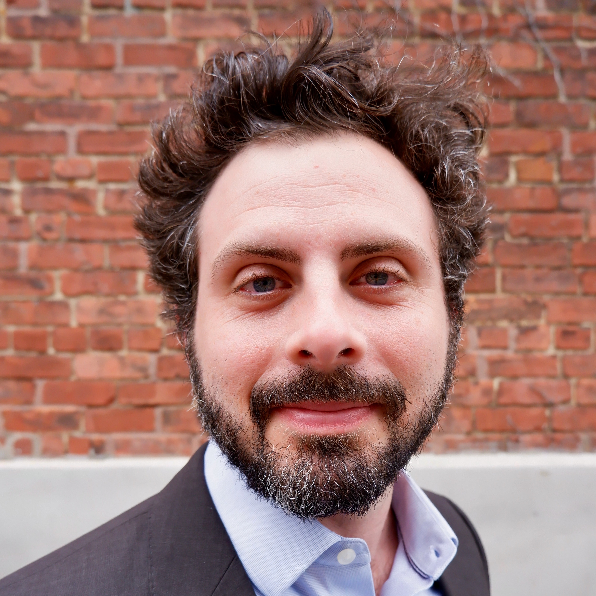
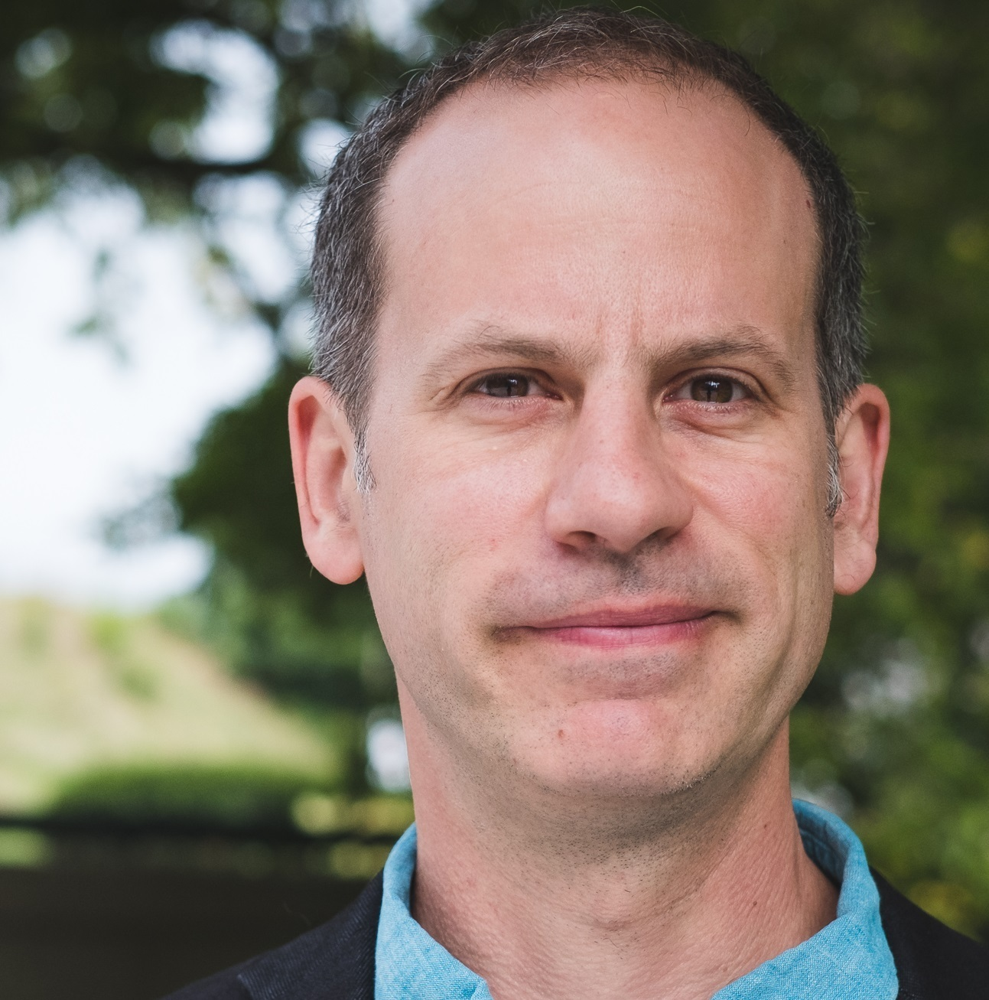
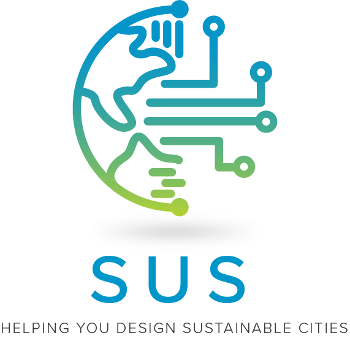
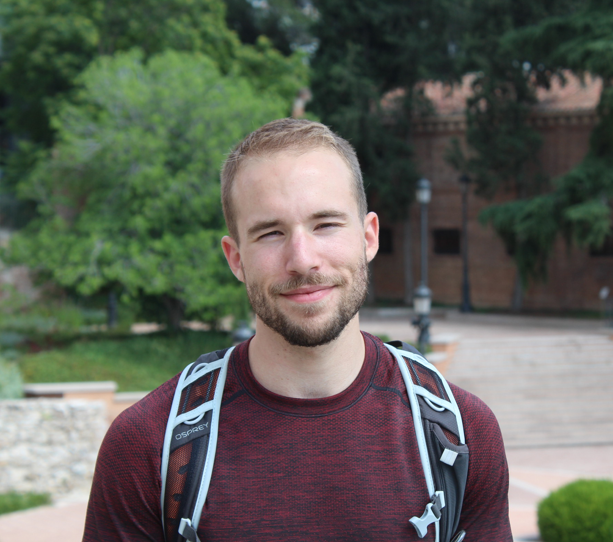

```{r setup, include=FALSE}
knitr::opts_chunk$set(echo = FALSE)

# The code chunk named css includes all the css for this page. It's exported to all the SUS app, so everything in that css chunk should be starting by '.mtt_mate', so that it's applied only in the content of this script. 'mtt_mate' is the name of the divs' class used here. Every other code chunk which is the presentation for each individual team member should be preceded by '<div class="mtt_mate">' and ended with '</div>' to indicate that every code chunk is a new div, with the 'mtt_mate' css class taken. 

```

```{css}

.mtt_horizontal_block {
  position:relative;
  margin:30px;
  border-spacing: 5px;
  padding: 5px 5px 5px 5px;
  # box-shadow: 0 1px 3px rgba(0,0,0,0.12), 0 1px 2px rgba(0,0,0,0.24);
  justify-content:center;
  text-align:center;
  max-width:1000px;

}

.mtt_mate {
  position: relative;
  margin: 15px;
  align-content: center;
  display:inline-block;
}

.mtt_mate img {
  position: relative;
  width: 175px;
  height: 175px;
  object-fit: cover;
  border-radius: 50%;
    border-top-left-radius: 50%;
    border-top-right-radius: 50%;
    border-bottom-right-radius: 50%;
    border-bottom-left-radius: 50%;
  transition: transform 0.5s;
}

.mtt_mate img:hover {
  transform: scale(1.05);
  box-shadow: 0 14px 28px rgba(0,0,0,0.1);
}

.mate_name{
  font-weight: bold;
  font-size:15px;
  font-color:#3C3C3B;
  display:block;
  position:relative;
  top:10px;
  text-align: center;
}

.mtt_mate p.caption {
  visibility: hidden;
  width: 500px;
  background-color: white;
  text-align: left;
  color: #3C3C3B;
  padding: 20px ;
  border-radius: 6px;
  top: -5px;
  left: -90%;
  position: absolute;
  z-index: 1;
  opacity: 0;
  transition: opacity 1s;
  transition: all 0.2s ease-out;
}

.mtt_mate:hover p.caption {
  visibility: visible;
  opacity: 1;
  transition: opacity 1s;
    box-shadow: 0 14px 28px 0 rgba(0,0,0,0.1);
}

.mtt_mate a{
  color: #0096C9;
}


```

<div class ="mtt_horizontal_block">
## Principal Investigators
<div class="mtt_mate">
```{r david_Wachsmuth,  fig.cap="<strong><big><a href = 'https://upgo.lab.mcgill.ca/' target='_blank'>David Wachsmuth</a></big></strong><br>David Wachsmuth is the Canada Research Chair in Urban Governance at McGill University, where he is also an Associate Professor in the School of Urban Planning. He directs UPGo, the Urban Politics and Governance research group at McGill, where he leads a team of researchers investigating pressing urban governance problems related to economic development, environmental sustainability, and housing markets. He is the co-lead of the Adapting Urban Environments for the Future theme of the McGill Sustainability Systems Initiative, where he is part of a broad interdisciplinary team developing new ways of conceptualizing, measuring, and improving urban sustainability. A major focus of his work has been explaining a transition in policy and planning from identifying the city as a global sustainability problem to identifying the city as a solution to global sustainability problems. He is one of the world’s leading experts on the impacts of short-term rental platforms such as Airbnb on cities around the world, and consults widely with municipalities and community organizations on designing appropriate regulations. Dr. Wachsmuth has published widely in top journals in urban studies, planning and geography, and his work has been covered extensively in the national and international media, including the New York Times, the Wall Street Journal, the Associated Press, and the Washington Post. He is the Early Career Editor of the journal <i>Territory, Politics, Governance</i> and serves on the editorial boards of the journal <i>Urban Geography</i>."}


```
<span class="mate_name">David Wachsmuth</span>
</div>

<div class="mtt_mate">
```{r kevin_manaugh,  fig.cap="<strong><big><a href = '' target='_blank'>Kevin Manaugh</a></big></strong><br>Kevin Manaugh is an associate professor jointly appointed in the Department of Geography and the Bieler School of Environment. He studies urban transport systems through the lens of social and environmental justice and is interested in understanding and addressing the inequities involved in both the transport planning process and in the outcomes of plans and policies at a variety of scales."}



```
<span class="mate_name">Kevin Manaugh</span>
</div>

<div class="mtt_mate">
```{r andrew_gonzalez,  fig.cap="<strong><big><a href = '' target='_blank'>Andrew Gonzalez</a></big></strong><br>TEXT"}



```
<span class="mate_name">Andrew Gonzalez</span>
</div>
</div>
***
<div class="mtt_horizontal_block">
## Dashboard Designer

<div class="mtt_mate">
```{r ty_duff,  fig.cap="<strong><big><a href = '' target='_blank'>Ty Duff</a></big></strong><br>TEXT"}


```
<span class="mate_name">Ty Duff</span>
</div>
</div>
***
<div class="mtt_horizontal_block">
## Developers

<div class="mtt_mate">
```{r robin_basalaev_binder,  fig.cap="<strong><big><a href = '' target='_blank'>Robin Basalaev-Binder</a></big></strong><br>Robin completed her Master of Urban Planning in 2018 at McGill University. Her passion for social and racial justice, equity, as well as affordable and accessible housing has led her to pursue research centered on these issues. Her sustainability research focuses on access and equity in Canada, and the disparities present in Smart Cities approaches. She has also conducted studies exploring gentrification, urban resilience, short-term rentals in the housing system, and the intersection of immigration and housing. Robin is particularly interested in how communities marginalized by the system and individuals with vulnerable immigration status can participate in urban planning processes and advocacy. Her work focuses on the US, Canadian, and Latin American contexts. She plans to continue her research as a doctoral student in Urban Planning in 2021."}


```
<span class="mate_name">Robin Basalaev-Binder</span>
</div>

<div class="mtt_mate">
```{r qiao_zhao,  fig.cap="<strong><big><a href = 'https://www.linkedin.com/in/kohnsamuel/' target='_blank'>Qiao Zhao</a></big></strong><br>Qiao Zhao is a PhD student in the Department of Geography at McGill University. He received his Master of Urban Planning from the Texas A&M University. Qiao Zhao’s research focuses on the relationship between the built environment and travel behavior with a particular emphasis on bicycle equity. His work recognizes that cycling facilities – along with the accessibility and social gains that they can provide – are inequitably distributed across communities of varying socio-demographic composition. To explore the implications of this distribution for bicycle equity, Qiao’s dissertation investigates the current bicycle network’s equity performance, the potential impacts of cycling investment on travel behaviors among disadvantaged populations, and the equity implications of crowdsourced data to drive bicycle network planning decisions."}


```
<span class="mate_name">Qiao Zhao</span>
</div>

<div class="mtt_mate">
```{r samuel_kohn,  fig.cap="<strong><big><a href = 'https://www.linkedin.com/in/kohnsamuel/' target='_blank'>Samuel Kohn</a></big></strong><br>Of french and american origin, Samuel is an aspiring urban planner, currently enrolled in the Master of Urban Planning program at McGill University. He aims to contribute to the sustainable design of future cities and to the wellbeing of urban citizens. Samuel’s ambition is to focus on smart city projects that are more democratic, transparent, and that draw on collective and empirical knowledge in addition to big data in order to positively impact urban sustainability, resilience, and wellbeing. In his involvement in building the SUS interactive dashboard, Samuel has significantly developed his GIS, data visualization, and applied research skills. Samuel holds a Bachelor degree from McGill University in International Development, and speaks English and French fluently. Samuel also has 6+ years of experience in the field of economic development, supporting governments across the globe with their foreign direct investment attraction strategies."}


```
<span class="mate_name">Samuel Kohn</span>
</div>

<div class="mtt_mate">
```{r maxime_belanger_de_blois, fig.cap="<strong><big><a href = 'https://www.linkedin.com/in/maximebdeblois' target='_blank'>Maxime Bélanger De Blois</a></big></strong><br>Currently an urban planning master’s student at McGill University, Maxime previously completed a BA with honours in Political Science and Economics at Université Laval, together with a supplementary degree in Spanish language. As a bachelor's student, he delved into the application of sustainable development ideas to economic theories. His current academic interests lie in the application of political and economic concepts to territorial and environmental issues. In pursuing these objectives, Maxime believes data analysis and visualization techniques to be essential. He is now a research assistant with the Urban Politics and Governance Research group, where he primarily focuses on the analysis and impact of the short-term rental market in North American cities."}



```
<span class="mate_name">Maxime Bélanger De Blois</span>
</div>

<div class="mtt_mate">
```{r cloe_st_hilaire, fig.cap="<strong><big><a href = 'https://www.linkedin.com/in/clo%C3%A9-st-hilaire-b26020117/' target='_blank'>Cloé St-Hilaire</a></big></strong><br>Cloé St-Hilaire is currently a master’s student in Urban Planning at McGill University. She completed a Bachelor of Commerce in Sustainability Management and Urban Studies in 2019. Practical application of her education was gained while working in the social enterprise sector as a food security analyst for a vertical aquaponics start-up. Cloé also worked to promote female entrepreneurship in Senegalese women-led agriculture businesses. Her research interests are at the intersection of housing justice, financialization and the implication of the platform economy in the housing system. She is currently working as a research assistant with the UPGo group, working both on the dynamics of the short- and long-term rental markets as well as the sustainability dashboard."}


```
<span class="mate_name">Cloé St-Hilaire</span>
</div>
</div>